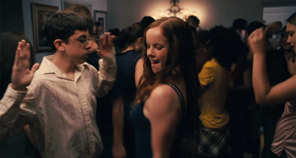
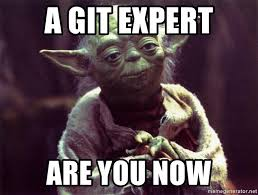

# EXAMEN SORPRESA

El equipo ganador se llevará una ronda de cubatas en Teatro Barceló, allá por 2025

## Instrucciones

1. Colocate sobre tu rama
2. Crear nombreequipo.txt
3. Cada miembro del equipo tiene que añadir una frase. 
4. En la carpeta imgfile_nombreequipo hay que añadir una captura en la que se demuestre que cada miembro del equipo ha hecho al menos un commit
5. Crear una PR poniendo a  Enrique como reviewer (enriquetttech)
6. Si esta todo correcto habréis acabado el ejercicio 

Se ponderara la velocidad de acabar el ejercicio como la originalidad de las frases

--
--
--
--
--
--
--

Si quiere que su equipo sea ganador echa un ojo al .gitignore